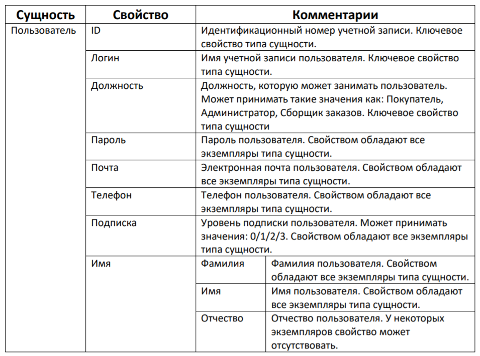
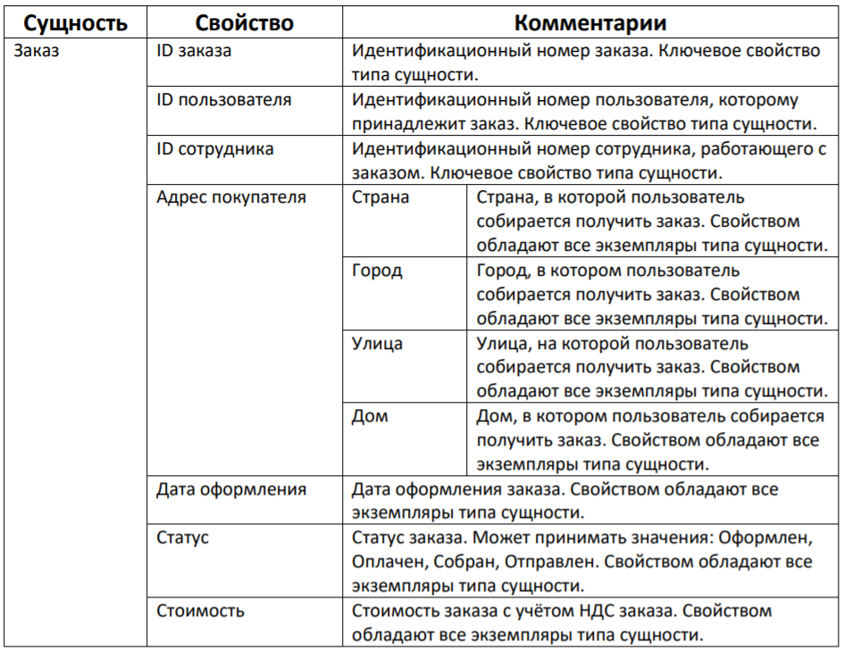
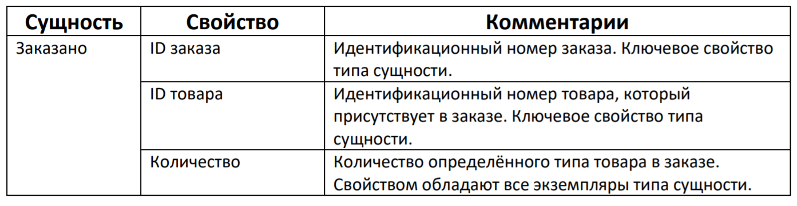
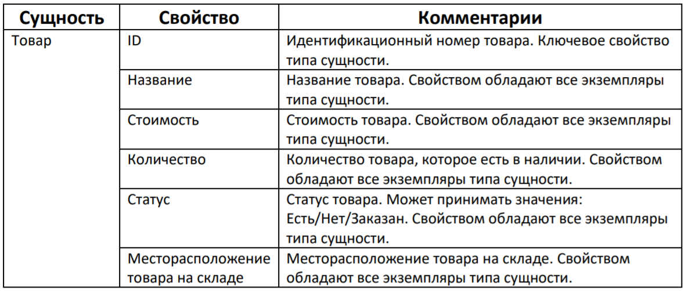
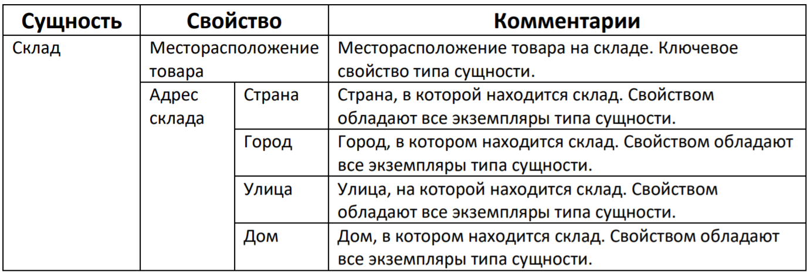
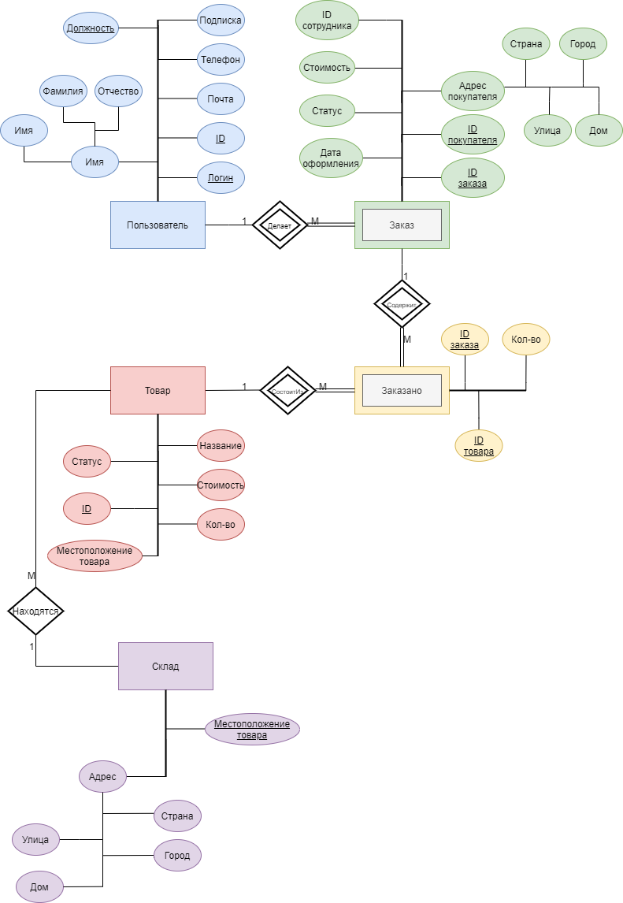
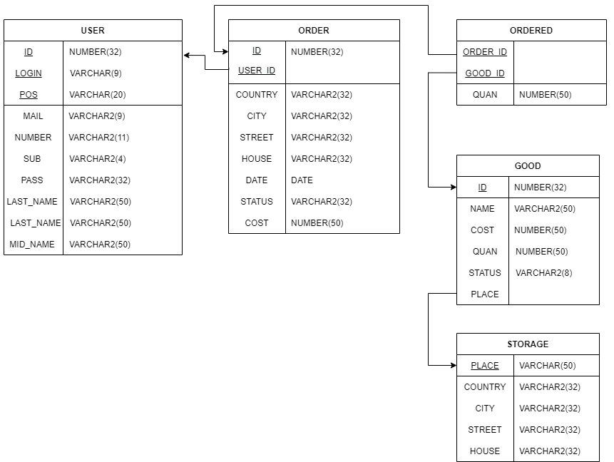

# 1. Список сущностей, свойств и связей

Таким образом, имеются следующие связи между сущностями:

- Связь один ко многим между покупателем и заказом (заказ не может существовать без пользователя, у одного пользователя может быть сколько угодно заказов);
- Связь один ко многим между заказом и заказанными вещами (в одном заказе может быть много заказанных вещей);
- Связь один к одному между заказанным товаром и товаром;
- Связь один ко многим между скалдом и товаром (много разных товаров может находиться на одном складе).

# 2. ER-диаграмма

# 3. Даталогическая модель

