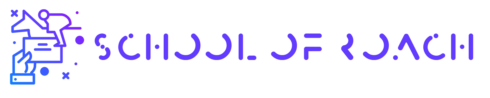

# School of Roach: Алхимия, руны, доспехи и другие полезности для ведьмаков

В зависимости от вашего региона промысла и цели охоты мы подберём вам наиболее оптимальный по цене и качетсву набор товаров, необходимых для зачистки.

# Так же в добавление к интернет-магазину в **Школе Плотвы** у вас есть 3 тарифа, на которые можно подписаться по желанию:

1. **Выпускник**: 

Только выпустились из школы и совсем не знаете, куда податься? Нет связей, проверенных рунных мастеров и алхимиков? Тогда этот тариф для вас! Мы предоставляем такие услуги как:
- [ ] Консультация по подбору масел для серебряного и стального мечей и контроль их (масел) качества
- [ ] Консультация по подбору бомб для уничтожения гнёзд чудовищ и контроль их (бомб) качества
- [ ] Консультация по подбору магических артефактов и контроль их (артефактов) качества
- [ ] Консультация по нанесению рун и контроль их (рун) качества
- [ ] Так же исключительно в этом тарифе мы предоставляем услуги консультанта -- ведьмака-ветерана Лето из Гулеты, отошедшего на покой тридцать лет назад -- который ответит вам на все вопросы, касающиеся убийства цели, поможет составить наиболее подходящую стратегию боя и расскажет обо всех слабостях цели.

2. **Боец**:

Уже не новичок и повидали виды? Давно не теряетесь у доски заказов? Есть пара кузнецов на примете, но не уверены в их способностях выковать гроссмейстерский доспех? Рунный мастер задрал цену настолько, что и трёх заказов на стрыгу не хватит для оплаты? Тогда этот тариф для вас:
- [ ] Консультация по подбору масел для серебряного и стального мечей и контроль их (масел) качества
- [ ] Консультация по подбору бомб для уничтожения гнёзд чудовищ и контроль их (бомб) качества
- [ ] Консультация по подбору магических артефактов и контроль их (артефактов) качества
- [ ] Консультация по нанесению рун и контроль их (рун) качества

3. **Легенда**:

О ваших подвигах ходят легенды красочнее, чем о Белом Волке? Есть давно наработанная база, но нет времени ходить по болотам ради поиска алкогеста? Тогда этот тариф для вас:
- [ ] Консультация по качеству масел для серебряного и стального мечей
- [ ] Консультация по качеству бомб для уничтожения гнёзд чудовищ
- [ ] Консультация по качеству магических артефактов

# Оплата, доставка и прочая бюрократия

Наш интернет-магазин принимает оплату исключительно в Нильфгаардских флоринах. Для удобства наших клиетов мы сотрудничаем с банком Вивальди. Курс перевода соотвествует курсу, указанному на сайте банка Вивальди.

Доставка осуществляется по всей территории Неверленда.

Для составления заявки на оформление заказа свяжитесь со специалистом.

# Специальные предложения

- Для **постоянных** клиентов осуществляется: _Бесплатная доставка_, _Скидки_ на масла и бомбы, _Скидки_ в Новиградских траявянных лавках.

- Мы сотрудничаем с Императрицей Цириллой Фионой Элен Рианнон, поэтому при предостовлении сведельсва о рождении в Нильфгаарде предлагается _скидка_ в размере 5 процентов от стоимости всего заказа или _талон_ на посещение "Роза Фиоры" на выбор.
