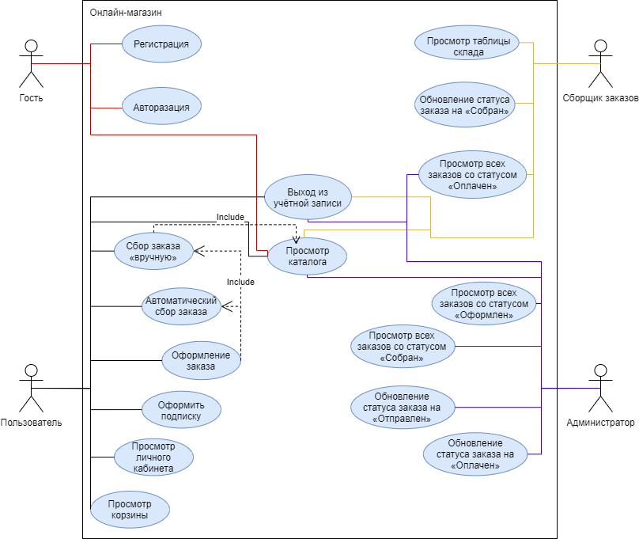

# 1. Список акторов:
Главная фишка магазина – это возможность указать, на какого монстра ведётся охота, а сайт автоматически подберёт вам наилучшие масла для меча, бомбы для уничтожения гнезда или какие-либо другие магические артефакты и зачарованные руны.

Помимо такого автоматического подбора сайт также является обычным интернет-магазином, где можно заказать необходимые вам товары или услуги.

Всего с проектом могут взаимодействовать 4 сущности: **гость**, **пользователь**, **сборщик заказов** и **администратор**.

**Гостю** доступны такие действия как:
- [ ] Регистрация
- [ ] Авторизация
- [ ] Просмотр каталога

**Пользователю** доступны такие действия как:
- [ ] Выход из учётной записи
- [ ] Просмотр каталога
- [ ] Сбор автоматического заказа
- [ ] Сбор заказа «вручную»
- [ ] Оформление заказа
- [ ] Просмотр личного кабинета со своими заказами и их статусом
- [ ] Оформить подписку
- [ ] Просмотр корзины

**Сборщику заказов** доступны такие действия как:
- [ ] Выход из учётной записи
- [ ] Просмотр каталога
- [ ] Просмотр всех заказов со статусом «Оплачен»
- [ ] Просмотр таблицы склада
- [ ] Обновление статуса заказа на «Собран»

**Администратору** доступны такие действия как:
- [ ] Выход из учётной записи
- [ ] Просмотр каталога
- [ ] Просмотр всех заказов со статусом «Оформлен»
- [ ] Просмотр всех заказов со статусом «Оплачен»
- [ ] Обновление статуса заказа на «Оплачен»
- [ ] Обновление статуса заказа на «Отправлен»

# 2. Диаграмма прецедентов использования:

# 3. Спецификации прецедентов использования:
| Прецедент использования | Регистрация пользователя |
| :------ | :--- |
| Краткое описание | Этот прецедент использования позволяет Гостю зарегистрировать в системе новую учетную запись |
| Действующие лица | Гость |
| Предусловия | Гость хочет зарегистрировать новую учетную запись |
| Основной поток | Прецедент использования начинается с того, что Гость решает зарегистрировать новую учетную запись и заполняет соответствующую регистрационную форму, обязательно указав свою фамилию, имя учетной записи и пароль, после чего отправляет заявку на регистрацию. Прецедент использования завершается |
| Альтернативные потоки | Гость неверно заполнил регистрационную форму или учетная запись с указанным именем уже существует. Заявка на регистрацию не создается, Гость получает сообщение об ошибке и должен либо повторно заполнить форму, продолжая прецедент использования, либо отменить регистрацию, завершая прецедент использования |
| Постусловия | Если прецедент использования завершился успешно, в системе регистрируется новая учетная запись, в противном случае состояние системы остается неизменным |

| Прецедент использования | Авторизация |
| :------ | :--- |
| Краткое описание | Этот прецедент использования позволяет Гостю войти в свою учётную запись |
| Действующие лица | Гость |
| Предусловия | Гость хочет войти в свою учётную запись |
| Основной поток | Прецедент использования начинается с того, что Гость решает зайти в свою учётную запись и заполняет необходимую форму, включающую в себя имя учётной записи и её пароль, после чего Гость входит в свой личный кабинет. Прецедент использования завершается |
| Альтернативные потоки | Гость неверно заполнил форму авторизации, вход не совершился, Гость получает сообщение об ошибке и должен либо повторно заполнить форму авторизации, продолжая прецедент использования, либо отменить попытки входа, завершая прецедент использования|
| Постусловия | Если прецедент использования завершился успешно, то пользователь попадает в свой личный кабинет, в противном случае состояние системы остается неизменным |

| Прецедент использования | Просмотр каталога |
| :------ | :--- |
| Краткое описание | Этот прецедент использования позволяет Гостю, Пользователю, Администратору и Сборщику заказов просмотреть каталог товаров, представленных на сайте |
| Действующие лица | Гость, Пользователь, Администратор, Сборщик заказов |
| Предусловия | Гость, Пользователь, Администратор или Сборщик заказов нажал на ссылку каталога |
| Основной поток | Прецедент использования заключается в адресации на страницу, где расположены фотографии и цены всей продукции магазина |
| Альтернативные потоки | - |
| Постусловия | Гость, Пользователь, Администратор или Сборщик заказов остался на странице каталога |

| Прецедент использования | Выход из учётной записи |
| :------ | :--- |
| Краткое описание | Этот прецедент использования позволяет Пользователю, Администратору и Сборщику заказов выйти из своей учётной записи |
| Действующие лица | Пользователь, Администратор, Сборщик заказов |
| Предусловия | Пользователь, Администратор или Сборщик заказов нажал на иконку «выйти из учётной записи» |
| Основной поток | Прецедент использования заключается в выходе из своей учётной записи |
| Альтернативные потоки | - |
| Постусловия | Пользователь, Администратор или Сборщик заказов теперь является Гостем |

| Прецедент использования | Сбор заказа «вручную» |
| :------ | :--- |
| Краткое описание | Этот прецедент использования позволяет Пользователю собрать заказ из ассортимента, представленного в каталоге |
| Действующие лица | Пользователь |
| Предусловия | Пользователь находиться на странице каталога |
| Основной поток | Пользователь кладёт в корзину выбранный им товар, после чего ему предлагается продолжить просматривать каталог, продолжая прецедент использования, или перейди к корзине для оформления заказа, после чего прецедент использования завершается |
| Альтернативные потоки | Если Пользователь недоволен выбранным товаром, то Пользователю предлагается очистить корзину и продолжить прецедент использования |
| Постусловия | Если прецедент использования завершён успешно, то у Пользователя появляется заказ в корзине, готовый к оформлению, в противном случае состояние системы остается неизменным |

| Прецедент использования | Автоматический сбор заказа |
| :------ | :--- |
| Краткое описание | Этот прецедент использования помогает автоматически сформировать заказ |
| Действующие лица | Пользователь |
| Предусловия | Пользователь выбрал функцию автоматический сбор заказа |
| Основной поток | Прецедент использования заключается в заполнении формы, в которой необходимо указать местность проведения охоты, а также тип существа, после чего у Пользователя в корзине появляется автоматически собранный заказ. Прецедент использования завершается |
| Альтернативные потоки | Если пользователь неверно указал тип существа, то ему предлагается перепроверить правописание. Если Пользователь указал тип существа, которого не существует в нашем каталоге, то ему предлагают связаться с менеджером магазина, а форма удаляется. После чего Пользователя перенаправляют на страницу каталога, а прецедент использования завершается |
| Постусловия | Если прецедент использования завершён успешно, то у Пользователя появляется заказ в корзине, готовый к оформлению, в противном случае состояние системы остается неизменным |

| Прецедент использования | Оформление заказа |
| :------ | :--- |
| Краткое описание | Пользователь оформляет заказ, лежащий у него в корзине |
| Действующие лица | Пользователь |
| Предусловия | Пользователь переходит в корзину и нажимает на оформление заказа |
| Основной поток | Пользователь заполняет форму, в которой ему надо ввести адрес доставки и свою электронную почту, куда придут реквизиты на оплату, после чего заказ отправляется в таблицу заказов |
| Альтернативные потоки | Если корзина Пользователя пуста, то выводиться сообщение об ошибке, и прецедент использования завершается. Если форма заполнена неверно, то Пользователь получает сообщение об ошибке, а форма предлагается заполниться заново, продолжая прецедент использования, либо предлагается отменить оформление заказа, завершая прецедент использования |
| Постусловия | Если прецедент использования завершён успешно, то у пользователя очищается корзина, а его заказ появляется в таблице заказов, в противном случае состояние системы остается неизменным |

| Прецедент использования | Оформить подписку |
| :------ | :--- |
| Краткое описание | Пользователю предлагается оформить одну из трёх существующих подписок |
| Действующие лица | Пользователь |
| Предусловия | Пользователь нажал на ссылку подписки |
| Основной поток | Пользователю предоставляется на выбор три тарифа, один из которых он может выбрать, после того завершения выбора пользователю предлагается заполнить форму, которая включает в себя адрес электронной почты, на которую придут реквизиты оплаты |
| Альтернативные потоки | Если пользователь ошибся, то предлагается отменить оформление подписки, завершая прецедент использования. Если форма заполнена неверно, то Пользователь получает сообщение об ошибке, а форма предлагается заполниться заново, продолжая прецедент использования, либо предлагается отменить оформление заказа, завершая прецедент использования |
| Постусловия | Если прецедент использования завершился успешно, то заявка пользователя на оформление подписки появляется в таблице, в противном случае состояние системы остается неизменным |

| Прецедент использования | Просмотр личного кабинета |
| :------ | :--- |
| Краткое описание | Этот прецедент использования позволяет Пользователю просмотреть свои заказы и их статус |
| Действующие лица | Пользователь |
| Предусловия | Пользователь переходит на страницу личного кабинета |
| Основной поток | Прецедент использования заключается в адресации на страницу, содержащую все заказы Пользователя и их статус |
| Альтернативные потоки | - |
| Постусловия | Пользователь находиться на странице личного кабинета |

| Прецедент использования | Просмотр корзины |
| :------ | :--- |
| Краткое описание | Этот прецедент использования позволяет Пользователю просмотреть содержимое своей корзины |
| Действующие лица | Пользователь |
| Предусловия | Пользователь перешёл на страницу корзины |
| Основной поток | Прецедент использования заключается в адресации на страницу, содержащую все товары, положенные в корзину |
| Альтернативные потоки | - |
| Постусловия | Пользователь находиться на странице корзины |

| Прецедент использования | Просмотр всех заказов со статусом «Оплачен» |
| :------ | :--- |
| Краткое описание | Этот прецедент использования позволяет Сборщику заказов или Администратору увидеть все заказы со статусом «Оплачен» с адресами электронной почты, на которую был оформлен заказ, и адресом доставки |
| Действующие лица | Сборщик заказов, Администратор |
| Предусловия | Сборщик заказов или Администратор переходит на страницу личного кабинета и нажимает на кнопку «Просмотреть таблицу оплаченных заказов» |
| Основной поток | Сборщик заказов или Администратор нажимает на кнопку, тем самым отправляя запрос в таблицу заказов, и ему выводятся все заказы со статусом «Оплачен» с адресами электронной почты, на которую был оформлен заказ, и адресом доставки |
| Альтернативные потоки | - |
| Постусловия | Сборщик заказов или Администратор получает таблицу оплаченных заказов с адресами электронной почты, на которую был оформлен заказ, и адресом доставки |

| Прецедент использования | Просмотр таблицы склада |
| :------ | :--- |
| Краткое описание | Этот прецедент использования позволяет Сборщику заказов увидеть все товары и их месторасположение на складе |
| Действующие лица | Сборщик заказов |
| Предусловия | Сборщик заказов переходит на страницу личного кабинета и нажимает на кнопку «Просмотреть склад» |
| Основной поток | Сборщик заказов нажимает на кнопку, тем самым отправляя запрос в таблицу склада, и ему выводятся все позиции |
| Альтернативные потоки | - |
| Постусловия | Сборщик заказов видит таблицу склада |

| Прецедент использования | Обновление статуса заказа на «Собран» |
| :------ | :--- |
| Краткое описание | Сборщик заказов обновляет статус заказа с «Оплачено» на «Собран» |
| Действующие лица | Сборщик заказов |
| Предусловия | Сборщик заказов переходит на страницу личного кабинета и нажимает на кнопку «Изменить статус заказа» |
| Основной поток | Сборщик заказов нажимает на кнопку и ему предлагается заполнить форму, в которую необходимо внести номер заказа и выбрать новый статус, после чего Сборщик заказов нажимает кнопку «Отправить», тем самым отправляя запрос в таблицу заказов, и прецедент использования завершается |
| Альтернативные потоки | Если заказа, статус которого пытается обновить Сборщик заказов, не существует или не является оплаченным, то выводится сообщение об ошибке, а прецедент завершается. Если форма заполнена неверно, то Сборщик заказов получает сообщение об ошибке, и он должен либо повторно заполнить форму, продолжая прецедент использования, либо отменить изменения, завершая прецедент использования |
| Постусловия | Если прецедент использования завершён успешно, то статус выбранного заказа изменяется на «Собран», и таблица заказов обновляется, в противном случает состояние системы остается неизменным |

| Прецедент использования | Просмотр заказов со статусом «Оформлен» |
| :------ | :--- |
| Краткое описание | Этот прецедент использования позволяет Администратору увидеть таблицу заказов со статусами «Оформлен» с адресами электронной почты, на которую был оформлен заказ, и адресом доставки |
| Действующие лица | Администратор |
| Предусловия | Администратор переходит на страницу личного кабинета и нажимает на кнопку «Просмотреть оформленные заказы» |
| Основной поток | Администратор нажимает на кнопку, отправляя тем самым запрос в таблицу заказов, и ему выводятся все заказы со статусом «Оплачен», а также электронные адреса пользователей, оплативших заказ, и адрес доставки |
| Альтернативные потоки | - |
| Постусловия | Администратор видит таблицу заказов со статусом «Оплачен» а также электронные адреса пользователей, оплативших заказ, и адрес доставки |

| Прецедент использования | Просмотр заказов со статусом «Собран» |
| :------ | :--- |
| Краткое описание | Этот прецедент использования позволяет Администратору увидеть таблицу заказов со статусами «Собран» с адресами электронной почты, на которую был оформлен заказ, и адресом доставки |
| Действующие лица | Администратор |
| Предусловия | Администратор переходит на страницу личного кабинета и нажимает на кнопку «Просмотреть собранные заказы» |
| Основной поток | Администратор нажимает на кнопку, отправляя тем самым запрос в таблицу заказов, и ему выводятся все заказы со статусом «Собран», а также электронные адреса пользователей, оплативших заказ, и адрес доставки |
| Альтернативные потоки | - |
| Постусловия | Администратор видит таблицу заказов со статусом «Собран» а также электронные адреса пользователей, оплативших заказ, и адрес доставки |

| Прецедент использования | Обновление статуса заказа на «Оплачен» |
| :------ | :--- |
| Краткое описание | Администратор обновляет статус заказа с «Оформлен» на «Оплачен» |
| Действующие лица | Администратор |
| Предусловия | Администратор переходит на страницу личного кабинета и нажимает на кнопку «Изменить статус заказа» |
| Основной поток | Администратор нажимает на кнопку и ему предлагается заполнить форму, в которую необходимо внести номер заказа и выбрать новый статус, после чего Администратор нажимает кнопку «Отправить», тем самым отправляя запрос в таблицу заказов, и прецедент использования завершается |
| Альтернативные потоки | Если заказа, статус которого пытается обновить Администратор, не существует или не является оформленным, то выводится сообщение об ошибке, а прецедент завершается. Если форма заполнена неверно, то Администратор заказов получает сообщение об ошибке, и он должен либо повторно заполнить форму, продолжая прецедент использования, либо отменить изменения, завершая прецедент использования |
| Постусловия | Если прецедент использования завершён успешно, то статус выбранного заказа изменяется на «Оплачен», и таблица заказов обновляется, в противном случает состояние системы остается неизменным |

| Прецедент использования | Обновление статуса заказа на «Отправлен» |
| :------ | :--- |
| Краткое описание | Администратор обновляет статус заказа с «Собран» на «Отправлен» |
| Действующие лица | Администратор |
| Предусловия | Администратор переходит на страницу личного кабинета и нажимает на кнопку «Изменить статус заказа» |
| Основной поток | Администратор нажимает на кнопку и ему предлагается заполнить форму, в которую необходимо внести номер заказа и выбрать новый статус, после чего Администратор нажимает кнопку «Отправить», тем самым отправляя запрос в таблицу заказов, и прецедент использования завершается |
| Альтернативные потоки | Если заказа, статус которого пытается обновить Администратор, не существует или не является собранным, то выводится сообщение об ошибке, а прецедент завершается. Если форма заполнена неверно, то Администратор заказов получает сообщение об ошибке, и он должен либо повторно заполнить форму, продолжая прецедент использования, либо отменить изменения, завершая прецедент использования |
| Постусловия | Если прецедент использования завершён успешно, то статус выбранного заказа изменяется на «Отправлен», и таблица заказов обновляется, в противном случает состояние системы остается неизменным |
